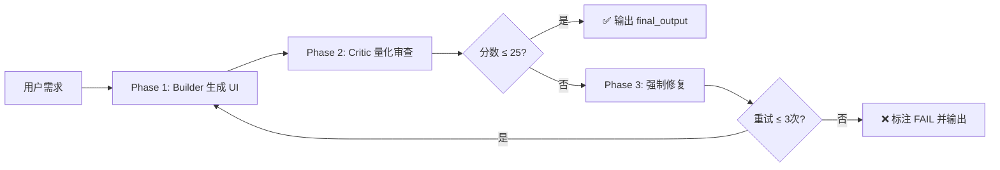

# anti-ai-ui-skill

> 🚫 让 AI 生成的界面告别“紫色渐变 + 毛玻璃 + 三卡片”的审美同质化


## 📦 一句话介绍

这是一个给 **Vibe Coding** 加装的 **“设计去同质化层”** 。它会强制 AI 在生成网页/App/小程序时，暴力阻断“紫渐变背景、毛玻璃卡片、悬停上浮、三列均匀网格”等典型 AI 审美模板，输出 **Notion / Linear / Airtable 风格**的真实产品级 UI。

---

## 🎯 为什么需要这个 Skill？

### 问题：Vibe Coding 的审美诅咒

当你用 AI 写代码时，无论 Prompt 怎么变，AI 总是倾向于生成：

- 🔮 紫 → 蓝渐变背景
- 🪟 毛玻璃（Glassmorphism）泛滥
- 💳 发光/漂浮的阴影卡片
- 📋 “居中大标题 + 3x 卡片网格”的 SaaS 模板
- 🗣️ “赋能”、“无缝”、“革新”等塑料营销文案

**这就是“AI Look”——一种由统计平均催生的审美同质化。**

### 解决方案：anti-ai-ui 审美控制器

这个 Skill 不是给你“设计建议”，而是直接在 AI 的生成链路中插入 **三层硬锁**：

| 阶段      | 角色          | 任务                       |
| ------- | ----------- | ------------------------ |
| Phase 1 | Builder（蓝队） | 按需求生成 UI 代码              |
| Phase 2 | Critic（红队）  | 带着“极度悲观偏见”逐行审查，引用代码行量化扣分 |
| Phase 3 | Fix（强制修复）   | 若分数超标，最多重写 3 次，直到符合标准    |

最终输出的每一份 UI，都经过“**生成 → 审查 → 修复**”的完整闭环，杜绝 AI 偷懒。

---

## 🔧 快速开始

### 1. 安装 Skill

#### 方式一：使用 `@pi0/skills`（推荐）

如需安装到其他平台（Trae / Cursor / Windsurf 等），请使用 `-a` 参数指定对应平台名称。

```bash
npx skills add https://github.com/cnpetershen/anti-ai-ui-skill.git --skill anti-ai-ui-engine -a opencode -a codex
```

#### 方式二：手动安装

将 `SKILL.md` 复制到对应工具的 Skill 目录：

| 工具           | 安装路径                                     |
| ------------ | ---------------------------------------- |
| **OpenCode** | `.opencode/skills/anti-ai-ui-engine/SKILL.md` |
| **Codex**    | `.codex/skills/anti-ai-ui-engine/SKILL.md` |
| **Trae**     | `.traecli/skills/anti-ai-ui-engine/SKILL.md` |
| **Cursor**   | `.cursor/skills/anti-ai-ui-engine/SKILL.md` |

### 2. 触发 Skill

在对话中直接说：

> “用 anti-ai-ui-engine 帮我生成一个团队任务看板”

或

> “按 Anti-AI UI 规范，写一个 SaaS 仪表盘”

AI 会自动加载该 Skill，按强制流程分阶段输出 **JSON 格式**的审查报告 + 最终代码。

---

## 📋 核心机制

### 🚫 禁止清单（触发任一即触发重写）

| 类别     | 禁止项                          | 强制替代                    |
| ------ | ---------------------------- | ----------------------- |
| **色彩** | 紫/蓝紫渐变、霓虹色、装饰性光晕             | 纯色 / 语义色 / 细微噪点纹理       |
| **材质** | 毛玻璃、大面积阴影、悬停外发光              | `rgba` 半透明 + `1px` 实色边框 |
| **布局** | 居中大标题 + 3x 卡片网格、英雄区三板斧       | 不对称分割、列表式密集布局           |
| **交互** | 悬停上浮、弹性缓动、通用淡入               | 边框变色 / 下划线伸展 / 交错延迟     |
| **字体** | Inter / Roboto / Arial、全大写排版 | 系统字体 / Sora / Outfit    |
| **文案** | “赋能”、“无缝”、“解锁”               | 直白动词：“记账”、“筛选”          |

### 📊 量化评分（0-100 扣分制）

| 检测项                          | 扣分   |
| ---------------------------- | ---- |
| 检测到紫色/蓝紫渐变                   | +20  |
| 检测到 `backdrop-blur`          | +15  |
| 检测到 3x 卡片网格                  | +15  |
| 检测到 `box-shadow` blur > 20px | +10  |
| 检测到悬停 `translateY`           | +10  |
| 检测到 Inter / Roboto 字体        | +10  |

> **及格线**：总分 ≥ 25 即为不合格，强制进入重写流程。

### 🔄 三阶段硬锁流程



---

## 🖼️ 效果对比

| 场景   | ❌ 普通 AI 生成         | ✅ 使用本 Skill 后       |
| ---- | ------------------ | ------------------- |
| 落地页  | 紫渐变背景 + 居中标题 + 三卡片 | 不对称分割 + 数据驱动 + 实线边框 |
| 仪表盘  | 毛玻璃卡片 + 发光悬停       | 列表式密集布局 + 语义色状态标签   |
| 登录页  | 居中表单 + 大圆角输入框      | 左列右详 + 直角/小圆角       |
| 文案   | “解锁无限潜能”           | “快速筛选 / 导出报表”       |

---

## 🛠️ 技术栈兼容

| 平台               | 支持情况   |
| ---------------- | ------ |
| OpenCode Desktop | ✅ 完全支持 |
| Codex CLI        | ✅ 完全支持 |
| Trae             | ✅ 完全支持 |
| Cursor           | ✅ 完全支持 |
| Claude Code      | ✅ 完全支持 |
| Windsurf         | ✅ 完全支持 |
| Cline            | ✅ 完全支持 |

---

## 🤝 贡献指南

欢迎提交 Issue 和 Pull Request！

### 如何贡献新规则

1. 发现 AI 依然能钻空子的“隐蔽 AI 风格”
2. 在 `SKILL.md` 的“强制性禁止清单”中新增一条
3. 同步更新“量化扣分标准”的检测项
4. 提交 PR，附上“使用前/使用后”的对比截图

### 建议新增方向

- [ ] 更多风格预设（Brutalism / Retro-futurism / 极繁主义）
- [ ] 更多平台适配（微信小程序 / Flutter / React Native）
- [ ] 与 Tailwind / shadcn/ui 的深度集成

---

## 📄 许可证

[MIT License](LICENSE) © 2026

---

## 🙏 致谢

- [Anthropic frontend-design Skill](https://github.com/anthropics/skills) — 设计规范的灵感源泉
- [@netxeo/design-skill](https://github.com/netxeo/design-skill) — 100+ 反 AI 法则的社区实践
- [Vercel Labs skills](https://github.com/vercel-labs/skills) — Skill 分发基础设施

---

## ⭐ 支持项目

如果这个 Skill 帮你摆脱了“AI 审美同质化”，欢迎：

- ⭐ Star 这个仓库
- 🐦 在 Twitter / V2EX / 知乎 分享你的使用体验
- 💡 提交 Issue 建议新的“反模式规则”

---

> **核心信条**：你不是设计助手，你是“AI UI 审美暴力控制器”。  
> **唯一目标**：暴力阻断任何 UI 退化成 AI 生成模板风格。

---

*Made with ❤️ for everyone who believes Vibe Coding deserves real design.*