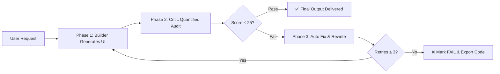

# anti-ai-ui-skill

> 🚫 Eliminate uniform AI UI aesthetics like purple gradients, frosted glass and triple-card layouts

## 📦 Overview
A design de-homogenization layer for Vibe Coding. It forcibly blocks overused AI UI patterns including purple gradient backgrounds, glassmorphism cards, hover lift effects and equal 3-column grids when generating web pages, apps and mini-programs, and delivers production-ready UIs in Notion/Linear/Airtable style.

## 🎯 Purpose
### Pain Point: The Generic AI UI Curse
No matter how you tweak prompts, AI code generators tend to produce identical-looking interfaces:
- 🔮 Purple-to-blue gradient backgrounds
- 🪟 Overused glassmorphism effects
- 💳 Glowing, floating shadow cards
- 📋 Standard SaaS template: centered headline + 3-card grid
- 🗣️ Cliché marketing buzzwords

This generic look is dubbed "AI Look" — uniform aesthetics caused by statistical averaging.

### Solution: anti-ai-ui Aesthetic Regulator
Instead of offering mild design tips, this skill embeds three strict enforcement locks into AI generation workflow:

| Stage       | Role       | Task                                                                 |
|-------------|------------|----------------------------------------------------------------------|
| Phase 1     | Builder    | Generate UI code based on requirements                               |
| Phase 2     | Critic     | Line-by-line audit with strict bias, deduct quantified scores per code line |
| Phase 3     | Fix Engine | Rewrite up to 3 times automatically if score exceeds threshold until compliant |

All final UIs go through a closed loop: Generate → Audit → Revise to prevent lazy generic outputs.

## 🔧 Quick Start
### 1. Install the Skill
#### Option 1: Via `@pi0/skills` (Recommended)
Add `-a` followed by platform name for Trae / Cursor / Windsurf and other tools.
```bash
npx skills add https://github.com/cnpetershen/anti-ai-ui-skill.git --skill anti-ai-ui-engine -a opencode -a codex
```

#### Option 2: Manual Installation
Copy `SKILL.md` to the skill directory of your tool:

| Tool         | Path                                                      |
|--------------|-----------------------------------------------------------|
| OpenCode     | `.opencode/skills/anti-ai-ui-engine/SKILL.md`             |
| Codex        | `.codex/skills/anti-ai-ui-engine/SKILL.md`                |
| Trae         | `.traecli/skills/anti-ai-ui-engine/SKILL.md`             |
| Cursor       | `.cursor/skills/anti-ai-ui-engine/SKILL.md`               |

### 2. Activate the Skill
Send prompts like:
> "Use anti-ai-ui-engine to build a team task dashboard"
Or
> "Build a SaaS dashboard following Anti-AI UI standards"

The skill loads automatically, outputting structured JSON audit reports plus finalized code.

## 📋 Core Mechanisms
### 🚫 Blocklist (Triggers mandatory rewrite if matched)
| Category  | Banned Patterns                                  | Mandatory Replacements                          |
|-----------|--------------------------------------------------|-------------------------------------------------|
| Colors    | Purple/violet gradients, neon glows, decorative halos | Solid colors / semantic hues / subtle noise textures |
| Materials | Glassmorphism, heavy shadows, hover outer glow    | Mild rgba transparency + thin solid 1px borders  |
| Layout    | Centered headline + 3-card grids, generic hero blocks | Asymmetrical split layouts, dense list-based UI |
| Interactions | Hover lift, bouncy easing, generic fades         | Border color shift / underline expand / staggered delays |
| Fonts     | Inter / Roboto / Arial, all-caps typography      | System fonts / Sora / Outfit                    |
| Copywriting | Buzzwords like empower, seamless, unlock         | Plain action verbs: log expenses, filter data   |

### 📊 Quantified Scoring (0–100 Deduction System)
| Detected Issue                     | Deduction Points |
|------------------------------------|------------------|
| Purple/violet gradient             | 20               |
| `backdrop-blur` glass effect       | 15               |
| Equal 3-column card grid           | 15               |
| `box-shadow` blur over 20px        | 10               |
| Hover `translateY` lift animation  | 10               |
| Inter / Roboto font usage          | 10               |

> Pass Threshold: Total deduction ≥ 25 = failed audit, forced rewrite triggered.

### 🔄 Three-Stage Locked Workflow


## 🖼️ Before & After Comparison
| Scene       | ❌ Default AI Output                     | ✅ With anti-ai-ui-skill                  |
|-------------|------------------------------------------|-------------------------------------------|
| Landing Page | Purple gradient, centered headline, 3 cards | Asymmetric layout, data-driven UI, solid borders |
| Dashboard    | Frosted glass cards, glowing hover states | Dense list layout, semantic status tags   |
| Login Page   | Centered form, huge rounded input boxes  | Two-column split, small/sharp rounded corners |
| Copywriting  | "Unlock boundless potential"             | "Quick filtering / export reports"         |

## 🛠️ Supported Platforms
| Platform          | Compatibility |
|-------------------|---------------|
| OpenCode Desktop  | ✅ Fully Supported |
| Codex CLI         | ✅ Fully Supported |
| Trae              | ✅ Fully Supported |
| Cursor            | ✅ Fully Supported |
| Claude Code       | ✅ Fully Supported |
| Windsurf          | ✅ Fully Supported |
| Cline             | ✅ Fully Supported |

## 🤝 Contribution Guide
Issues and Pull Requests are welcome!
### Add New Rules
1. Identify unblocked generic AI design loopholes
2. Append new bans to the mandatory blocklist in `SKILL.md`
3. Update corresponding scoring deduction rules
4. Submit PR with before/after UI screenshots

### Planned Feature Roadmap
- [ ] Extra style presets (Brutalism / Retro-futurism / Maximalism)
- [ ] Support more platforms (WeChat Mini Program / Flutter / React Native)
- [ ] Deep integration with Tailwind / shadcn/ui

## 📄 License
[MIT License](LICENSE) © 2026

## 🙏 Credits
- [Anthropic frontend-design Skill](https://github.com/anthropics/skills) — core design specification inspiration
- [@netxeo/design-skill](https://github.com/netxeo/design-skill) — community collection of 100+ anti-AI design rules
- [Vercel Labs skills](https://github.com/vercel-labs/skills) — skill distribution infrastructure

## ⭐ Support This Project
If this skill frees you from generic AI UI aesthetics:
- ⭐ Star this repository
- 🐦 Share your experience on Twitter / V2EX / Zhihu
- 💡 Submit Issues to propose new anti-pattern rules

> Core Creed: You are not a design assistant — you are a strict AI UI aesthetic regulator.
> Sole Mission: Fully block any UI from falling back to generic AI-generated templates.

*Made with ❤️ for developers who want authentic design in Vibe Coding.*
